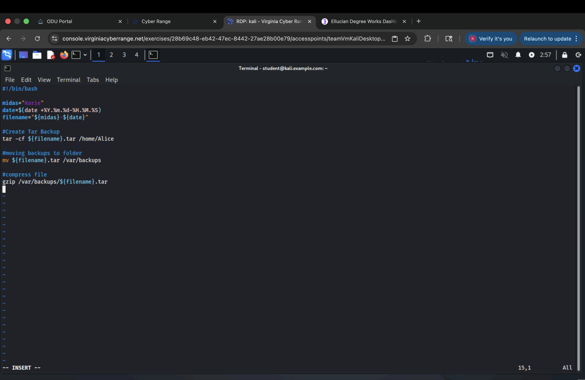
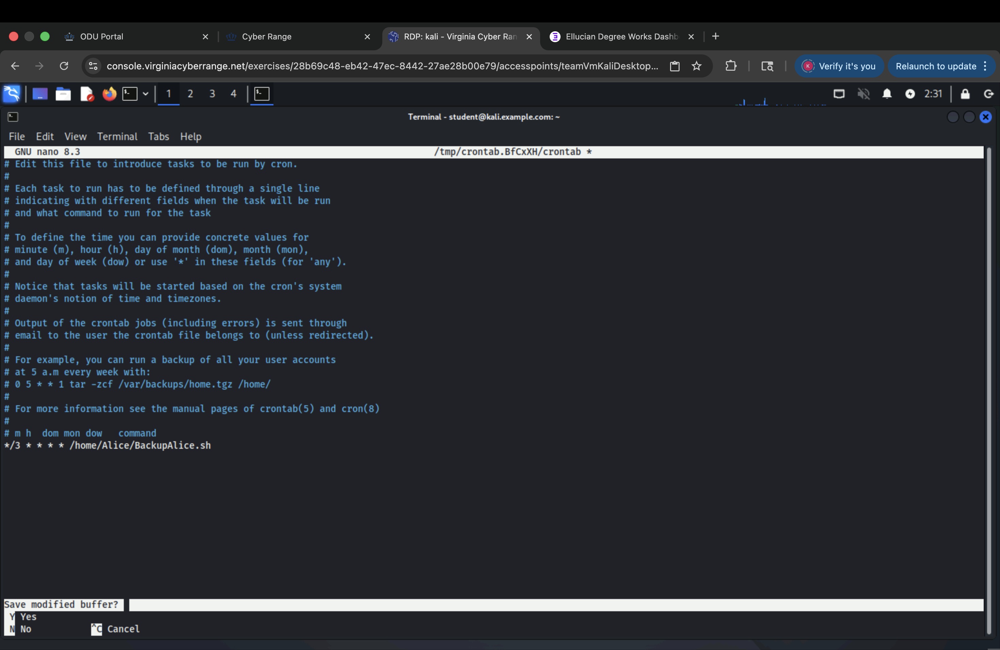
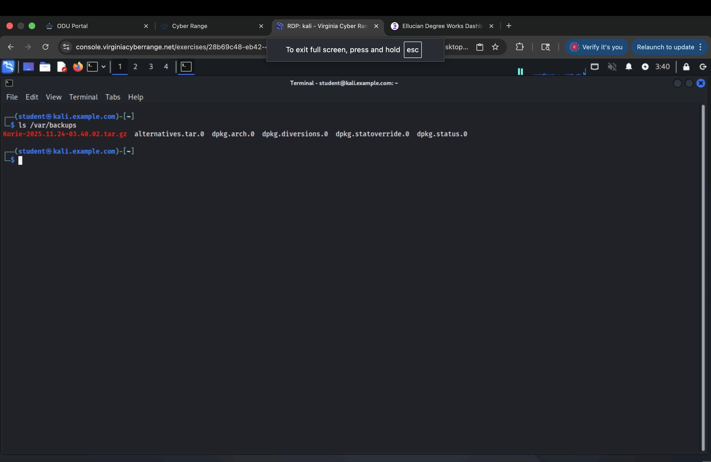
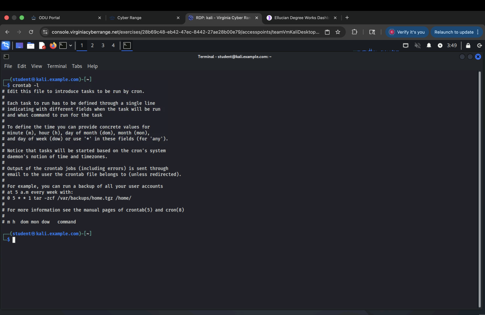

# Backup-using-Crontab-Automation
Bash script + crontab automation that backs up a user’s home directory into compressed tar archives on a scheduled interval .
# CYSE 270 – Assignment 9: Automated Backup with Cron

Screenshots and documentation for a Linux backup automation project using shell scripting and `cron`. The workflow creates a new user, backs up their home directory into a compressed tar archive, and schedules the job to run automatically.

## Walkthrough

Assignment Instructions:  

 
 
Step 1 - Create User Alice:  

 
 
Step 2 - Shell Script Logic:  

 
 
Step 3 - Crontab Setup:  

 
 
Step 3.5 - Move & Compress Archive:  

 
 
Step 4 - Verify Backup Output:  

 
 
Step 5 - Cancel Crontab Job:  

 
 

